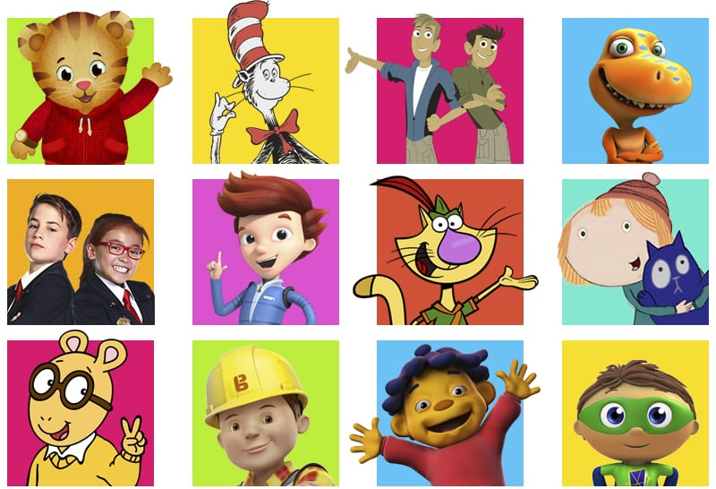

= Round 9 Answers

== Public Domain

Possible Points: 16

Time: 10 min.

1) This American filmmaker has produced over 30 documentaries which can be streamed on PBS today, who is he? *Ken Burns*

2) In 1999 who became the moderator of the PBS program Washington Week in Review making her the first black woman to host a national political talk show on television? *Gwen Ifill*

*Bonus!* After her death in 2016 her co-host of PBS NewsHour took over as host and still is today. Who is she? *Judy Woodruff*

3) What 2019 film tells the story of the life of Fred Rogers from Mister Roger's Neighborhood? *A Beautiful Day in the Neighborhood*

4) What year was the Corporation for Public Broadcasting created? *1967*

5) What PBS show was hosted by Bob Ross from 1983 to 1994? *The Joy of Painting*

6) The copyright extension act signed in 1998 that allowed Disney to keep Mickey Mouse out of the public domain is commonly nick-named after what late senator who co-sponsored the bill? *Sonny Bono*

7) What website, named after the inventor of the printing press, is considered an online library that is home to over 60,000 free eBooks? *www.gutenberg.org*

8) What date is Public Domain Day, the observance of when copyrights expire and works enter into the public domain? *January 1*

9) Name as many of these PBS Kids shows as you can. (1/2 point each)

[%autowidth,stripes=even,]
|===
| *Daniel Tiger's Neighborhood* | *The Cat and The Hat* | *Wild Kratts* | *Dinosaur Train*

| *Odd Squad*
| *Ready, Jet, Go*
| *Nature Cat*
| *Peg + Cat*

| *Arthur*
| *Bob the Builder*
| *Sid the Science Kid*
| *Super Why!*
|===

link:../../../index.html[Click here to return to the main site]
