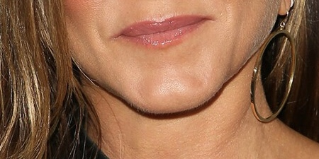
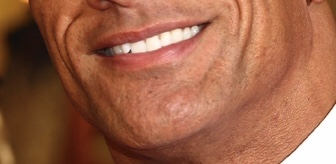
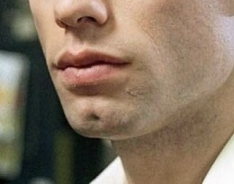
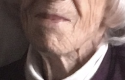

= Gen Z b like = 15 Minutes; 14 Points

=== PSA: We are not sorry

1) What does it mean if you "skrt"

    a) you throw on a fit
    b) you're pullin up
    c) you smell cap
    d) you've given up 

2) What does "tea" refer to

    a) something unflattering
    b) emotional baggage
    c) someone being cancelled
    d) gossip

=== Guess the person's chin!

3. 

4. 

5. 

6. 

===  A popular game played is called Incoherant. Each question has a combination of words that look like nonsense but when recited out loud sound like a hidden phrase. Try and sound 'em out. Example

Example: Hair Being Bee = air bnb

7. Dad Hill Bale

8. Toggled Hurt Heat Whom He (hint: Jason Derulo)

9. Meh come air ick auger rate akin (hint: red hat)

10. Birch who'll ray yell lid he (hint: goggles)

=== Name that song based on the emojis
Example: 🏠(⬆️)🌞 = House of the Rising Sun

11.🚀👨 

12.⛺🔥🎵🎵

13.🌞⤴️🌞🔥🌞⤵️

14.🦟🙋‍♂️2️⃣➡️🌜 

