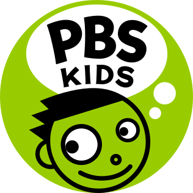
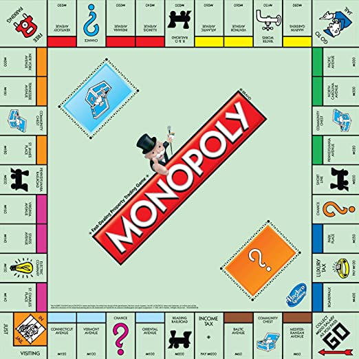
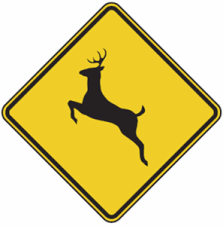
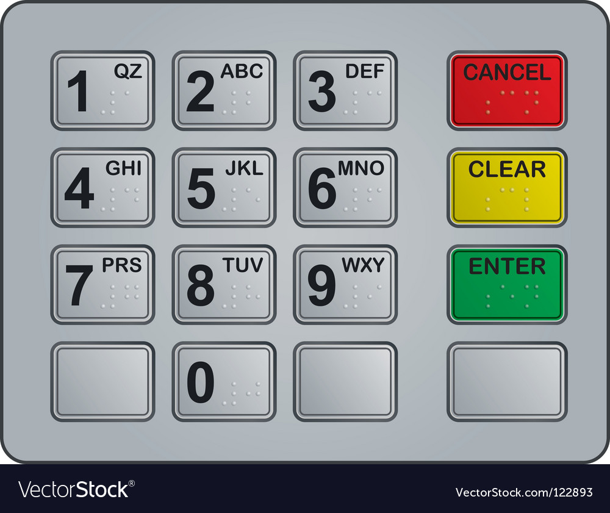
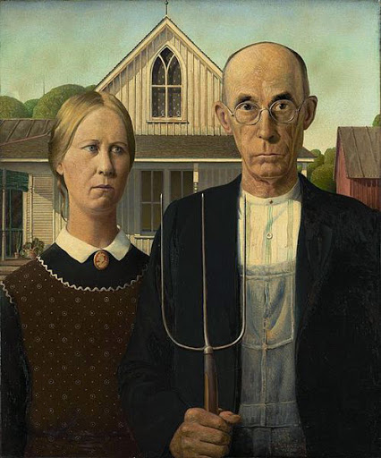
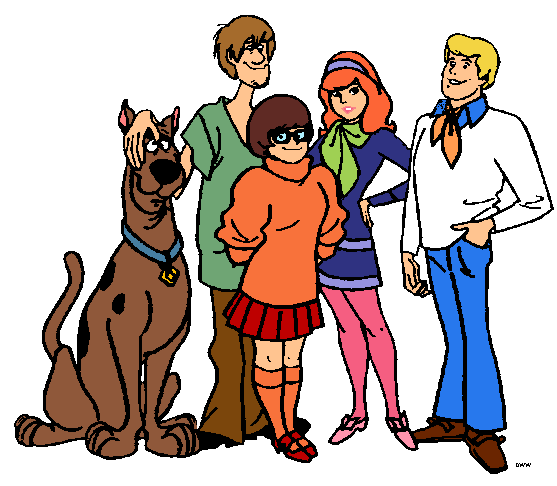
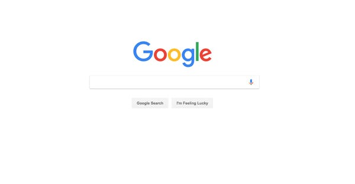

= Round 2 Answers

== Is anyone paying attention?

Possible Points: 10

Time: 10min.

1) Domestic electrical outlets in America supply how many volts? *120V*

2) What color is the PBS KIDS logo? *Green*

3) How many property color groups are in the standard version of Monopoly? *8*

4) What does .jpg (or .jpeg) stand for? *Joint Photographic Experts Group*

5) What is the _exact_ shape of a 'Deer Crossing' street sign? *Diamond*

6) How is the numerical keyboard configured on the vast majority of ATM Machines, like a telephone or like a calculator? *Telephone*

7) In the famous painting: American Gothic, what hand is the man holding a pitchfork in, his left hand or his right hand? *His Right Hand*

8) What is the official distance of the Kentucky Derby race? *1.25 Miles*

9) In the Scooby Doo animated cartoon, Daphne's main outfit consists of what 3 colors? *Green, Purple, and Pink*

10) On the Google homepage, next to the button labeled 'Google Search', there is another button. What does it say? *I'm Feeling Lucky*

