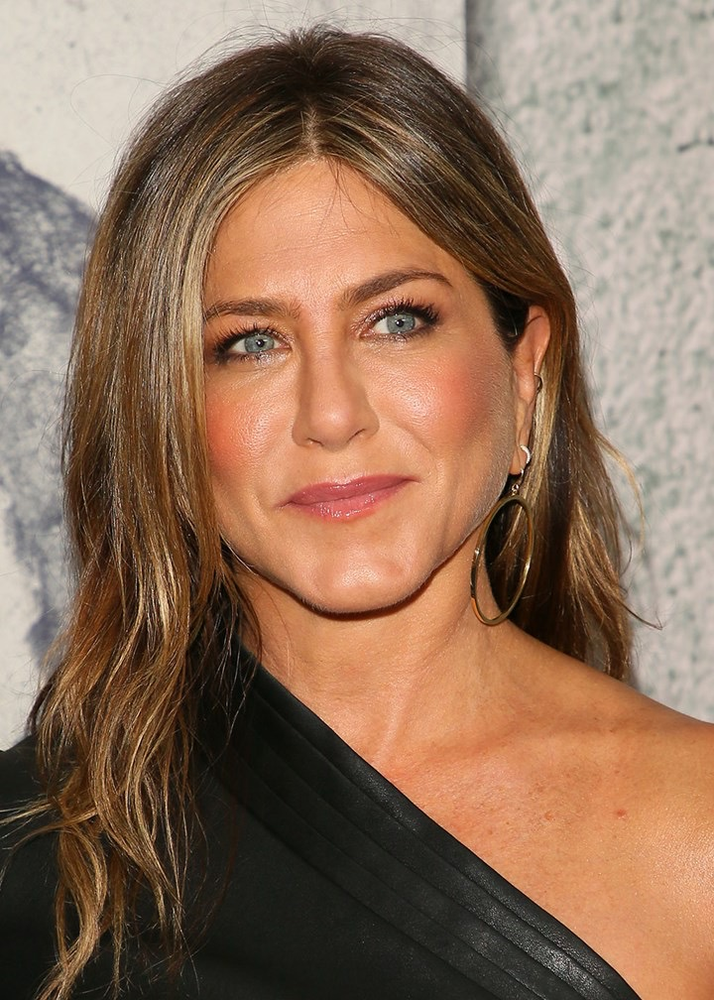
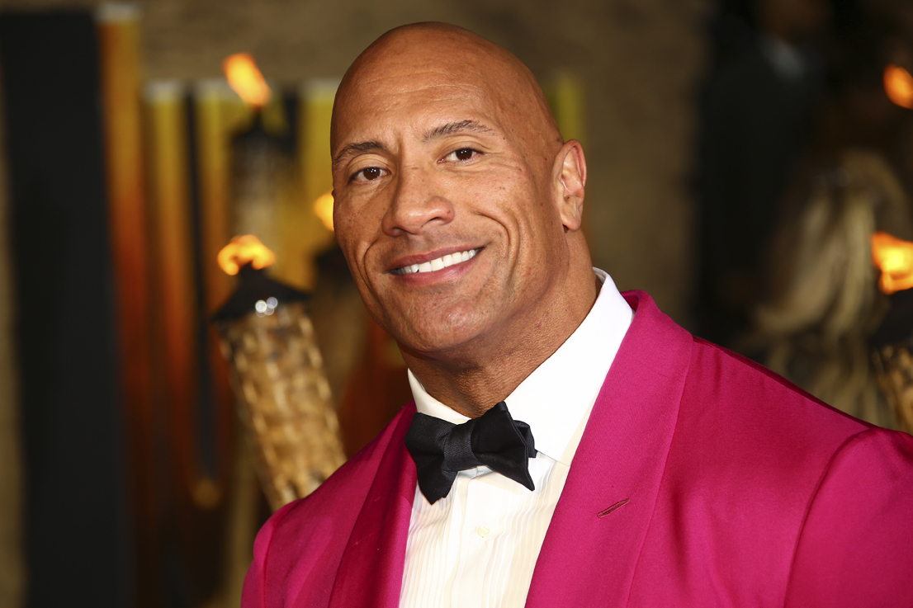
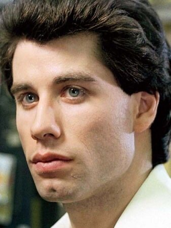
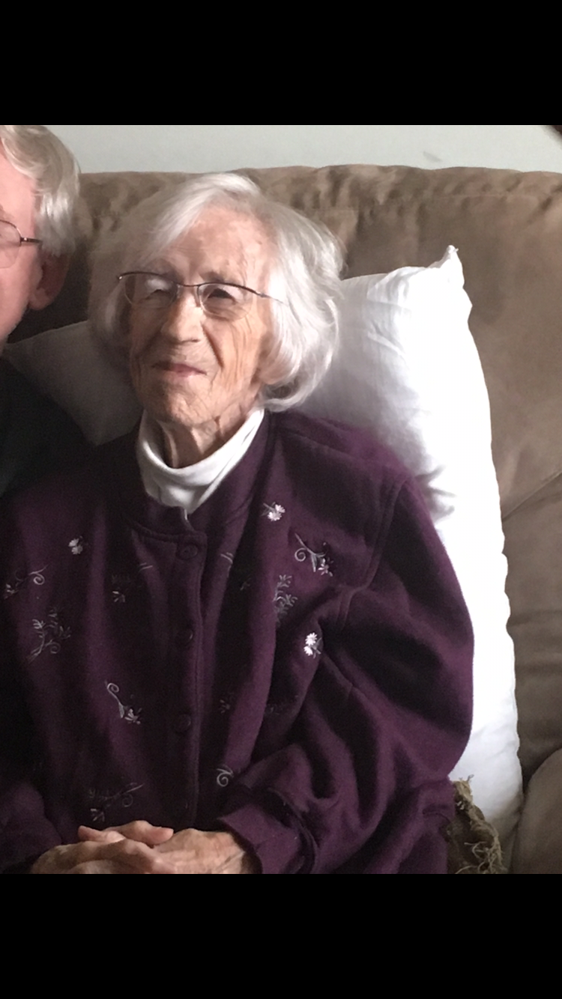

= Gen Z b like = 15 Minutes; 14 Points

=== PSA: We are not sorry

1) What does it mean if you "skrt"

    a) you throw on a fit
    === b) you're pullin up
    c) you smell cap
    d) you've given up 

2) What does "tea" refer to

    a) something unflattering
    b) emotional baggage
    c) someone being cancelled
    === d) gossip

=== Guess the person's chin!

3. 

- Jennifer Aniston

4. 

- Dwayne Johnson

5. 

- John Travolta

6. 

- Betty Danaher

===  A popular game played is called Incoherant. Each question has a combination of words that look like nonsense but when recited out loud sound like a hidden phrase. Try and sound 'em out. Example

Example: Hair Being Bee = air bnb

7. Dad Hill Bale 

- Tattletale

8. Toggled Hurt Heat Whom He (hint: Jason Derulo)

- Talk dirty to me

9. Meh come air ick auger rate akin (hint: red hat)

- Make America Great Again

10. Birch who'll ray yell lid he (hint: goggles)

- Virtual Reality

=== Name that song based on the emojis
Example: 🏠(⬆️)🌞 = House of the Rising Sun: The Animals

11.🚀👨 = Rocket Man: Elton John

12.⛺🔥🎵🎵 = The Campfire Song Song: Spongebob

13.🌞⤴️🌞🔥🌞⤵️ = Sunrise, Sunburn, Sunset: Luke Bryan

14.🦟🙋‍♂️2️⃣➡️🌜 = Fly Me to the Mood: Frank Sinatra

link:../index.html[Click here to return to the main site]