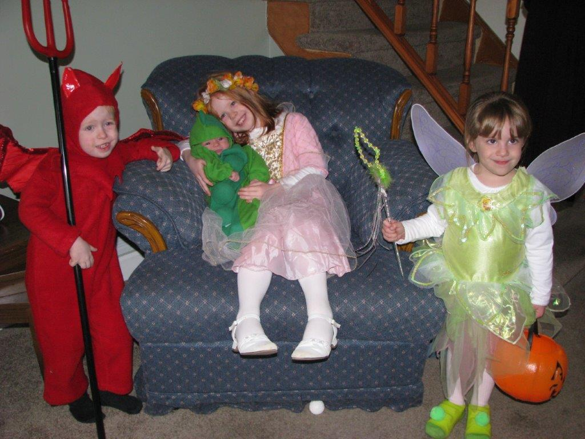
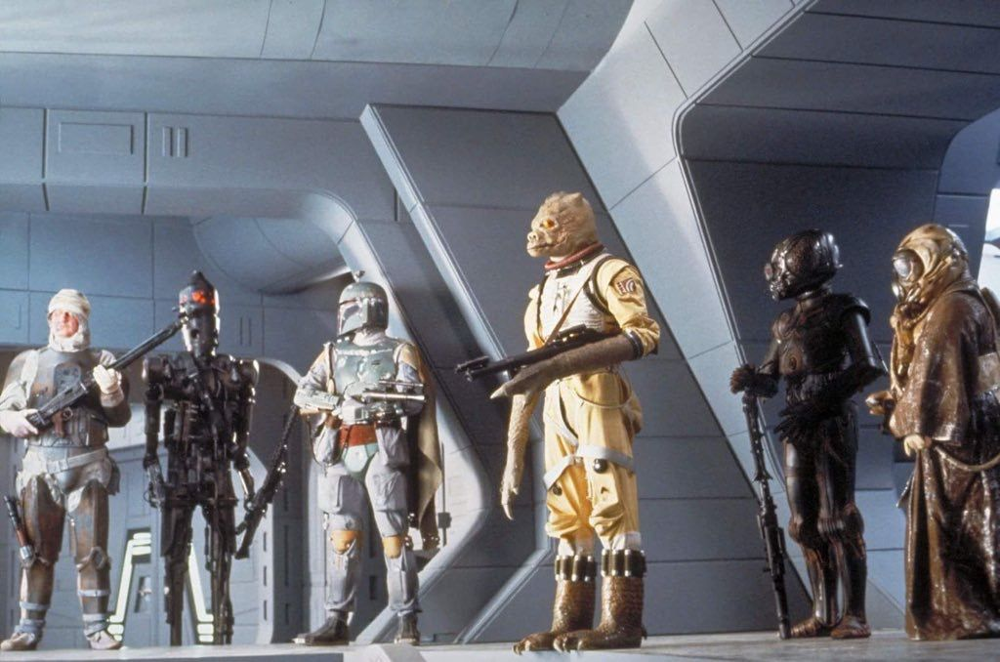

= Answer these questions about Hayes' Interests = 10 Minutes; 13 Ponts

=== This is Hayes for reference, he is the devil with the finger guns

1) Which of the following games are classified as "indie" games? (three correct answers)

    a) Castle Crashers
    b) Legend of Zelda: Breath of the Wind
    c) Super Smash Bros. Ultimate
    d) Hollow Knight
    e) Halo
    f) Spelunky
    g) Call of Duty

2) What is the offical job title of a grocery bagger?

3) In italy, there is a period in the day when everyone goes home, and all of the shops close for a couple hours. Around what time does this occur?

4) What is the total number of playable characters in Super Smash Bros. Ultimate, not including Minecraft Steve (+/-5)

5) In the MCU, how many Iron Man suits has Tony Stark made? (This does not refer to the amount seen in the movies, but the number of suits in total that Tony has made)

6) The following image shows six of the bounty hunters hired to find the Millennium Falcon in Star Wars: The Empire Strikes Back. name each character (1 point for each correct answer. Answers do not need to be in sequential order)

link:../index.html[Click here to return to the main site]