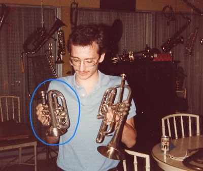

= Answer the random trivia based on Bridget's interests = 10 Minutes; 10 Points

This is Bridget for reference:

==== Tennis

1) What is the right side of the court called?

2) What animal intestines are used to make natural gut strings?

3) What is it called when the ball hits the net on a serve?

==== Caddy & Golf

4) What is the maximum number of clubs you are allowed to have in a golf bag (which is far too many for a caddy to have to caddy)?

5) What is the term called when a golfer uses their driver again after already using it to hit off the tee?

==== Band

6) Find the odd one out: Flank, Lyre, Mark Time, Backwards Harch

7) What is the name of the instrument that is in the man's right hand (who oddly looks like my father in his youth but, alas, is simply a man from google)

8) How long can a human person go without drinking water (not that they ever should)

    a) three weeks
    b) 14 days
    c) 3 days
    d) 48 hours

==== Music

9) Which scale is the only major scale that does not use sharps of flats? 

    a) F
    b) C
    c) B
    d) A

10) What does the term 'piano' mean when referring to dynamics in a song?

