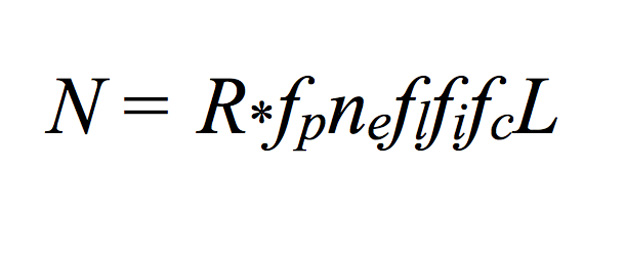

= Please Excuse My Dear Aunt Sally = 15 Minutes; 14 points

=== Bring our your calculators!

1) What is sin(90°)

- 1
 
Bonus: What is that answer in radians?

 - π/2

2) What is the perimeter of a circle known as?

- Circumference 

3) Who was the mathematician who invented the equation a²+b²=c²?

- Pythagoras

4) What do the terms hyperbola, ellipsis, parabola, and cricle refer to?

    a) asymptotes
    ===b) conic sections
    c) rational functions
    d) variables

5) Solve: 6-2(1+2) x 5 = ?

- -24

6) What does this equation help you find A = 1/2(b)(h)

- The Area of a Triangle

7) What is the speed of light (written in exponential form)?

- 3 x 10⁸

8) What does "m" stand for in the standard form equation y = mx + b

- the slope of a line

EXTRA CREDIT
The following is an equation meant to estimate the number of active, communicative extraterrestrial civilizations in the Milky Way Galaxy. Who was the person who developed this equation? (5 points)

- Dr. Frank Drake

link:../index.html[Click here to return to the main site]